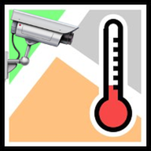

*Please :star: this repo if you find it useful*

# NarodMon Cloud Integration Component for Home Assistant

[![GitHub Release][releases-shield]][releases]
[![GitHub Activity][commits-shield]][commits]
[![License][license-shield]](LICENSE.md)

[![hacs][hacs-shield]][hacs]
[![Project Maintenance][maintenance-shield]][user_profile]
[![Support me on Patreon][patreon-shield]][patreon]

[![Community Forum][forum-shield]][forum]

_Component to integrate with Narodmon cloud and automatic search for the nearest sensors of the required type._



## Known Limitations and Issues

- At the moment, configuring the component is only possible through `configuration.yaml`. Support for configuration via Home Assistant UI will be added in the future.
- The Narodmon service has limits on the amount of data returned per request and on the frequency of sending requests. Therefore, if you configure several sensors, at first some of them may be in the `Unavailable` state. As data is received from the server, all sensors will receive their values.

## Breaking changes

- Since version 2.0.0 the field `apikey` is no longer required and is not recommended. Fill it out only if you already have your own API key with special limits. Otherwise, remove this field from your configuration.

## Installation

### Install via HACS (recommended)

1. Have [HACS][hacs] installed, this will allow you to easily manage and track updates.
1. Search for "Narodmon".
1. Click Install below the found integration.
1. <del>_If you want to configure component via Home Assistant UI..._\
    in the HA UI go to "Configuration" > "Integrations" click "+" and search for "Narodmon".</del>
1. _If you want to configure component via `configuration.yaml`..._\
    follow instructions below, then restart Home Assistant.

### Manual installation

1. Using the tool of choice open the directory (folder) for your HA configuration (where you find `configuration.yaml`).
2. If you do not have a `custom_components` directory (folder) there, you need to create it.
3. In the `custom_components` directory (folder) create a new folder called `narodmon`.
1. Download file `narodmon.zip` from the [latest release section][releases-latest] in this repository.
1. Extract _all_ files from this archive you downloaded in the directory (folder) you created.
6. Restart Home Assistant
1. <del>_If you want to configure component via Home Assistant UI..._\
    in the HA UI go to "Configuration" > "Integrations" click "+" and search for "Narodmon".</del>
1. _If you want to configure component via `configuration.yaml`..._\
    follow instructions below, then restart Home Assistant.

### Configuration Examples

```yaml
# Example configuration.yaml entry
narodmon:
  devices:
    - name: "Narodmon"
      sensors:
        - temperature
        - humidity
        - pressure
```

<p align="center">* * *</p>
I put a lot of work into making this repo and component available and updated to inspire and help others! I will be glad to receive thanks from you — it will give me new strength and add enthusiasm:
<p align="center"><br>
<a href="https://www.patreon.com/join/limych?" target="_blank"></a>
<br>or&nbsp;support via Bitcoin or Etherium:<br>
<a href="https://sochain.com/a/mjz640g" target="_blank"><br>
16yfCfz9dZ8y8yuSwBFVfiAa3CNYdMh7Ts</a>
</p>

### Configuration Variables

**apikey**:\
  _(string) (Optional)_\
  The API key is a unique identifier that authenticates requests associated with your project.

> **_Note_**:\
> This field is no longer required and is not recommended. Fill it out only if you already have your own API key with special limits.
>
> To obtain a key, you need to register on [narodmon.com](https://narodmon.com/), then open the menu item `Profile` > `My applications` > `New key` and create an API key. You can give any name to the key at your discretion.

**devices**:\
  _(list) (**Required**)_\
  List of virtual devices with uniform settings. See details below.

**verify_ssl**:\
  _(boolean) (Optional) (Default value: True)_\
  Verify SSL/TLS certificate for HTTPS request.

**timeout**:\
  _(number) (Optional) (Default value: 10)_\
  Timeout for the connection in seconds.

#### Device configuration variables

Each virtual device in a list have the following settings:

**name**:\
  _(template) (**Required**)_\
  Name of the device.

**latitude**:\
  _(float) (Optional) (Default value: Your home zone latitude defined in your configuration)_\
  Latitude of the center point of the sensor search area. The sensor closest to this point is always selected.

**longitude**:\
  _(float) (Optional) (Default value: Your home zone longitude defined in your configuration)_\
  Longitude of the center point of the sensor search area. The sensor closest to this point is always selected.

**scan_interval**:\
  _(number) (Optional) (Default value: 3 minutes)_\
  Minimum time interval between updates. Supported formats: `scan_interval: 'HH:MM:SS'`, `scan_interval: 'HH:MM'` and Time period dictionary.

> **_Note_**:\
> Since the service has data update limits, if you configure several sensors, the actual data update period may be proportionally longer than the one specified in this field.
>
> Updates more than once a minute are prohibited by Narodmon and can lead to permanent blocking of your account.

**sensors**:\
  _(list) (Optional) (Default value: all listed here sensor types)_\
  Types of sensors to be created. Available types:
  `temperature`, `humidity`, `pressure`, `wind_speed`, `wind_bearing`, `precipitation`, `illuminance`, `radiation`, `uv`, `pm`

## Track updates

You can automatically track new versions of this component and update it by [HACS][hacs].

## Troubleshooting

To enable debug logs use this configuration:
```yaml
# Example configuration.yaml entry
logger:
  default: info
  logs:
    custom_component.narodmon: debug
```
... then restart HA.

## Contributions are welcome!

This is an active open-source project. We are always open to people who want to
use the code or contribute to it.

We have set up a separate document containing our
[contribution guidelines](CONTRIBUTING.md).

Thank you for being involved! :heart_eyes:

## Authors & contributors

The original setup of this component is by [Andrey "Limych" Khrolenok](https://github.com/Limych).

For a full list of all authors and contributors,
check [the contributor's page][contributors].

## License

creative commons Attribution-NonCommercial-ShareAlike 4.0 International License

See separate [license file](LICENSE.md) for full text.

***

[component]: https://github.com/Limych/ha-narodmon
[commits-shield]: https://img.shields.io/github/commit-activity/y/Limych/ha-narodmon.svg?style=popout
[commits]: https://github.com/Limych/ha-narodmon/commits/dev
[hacs-shield]: https://img.shields.io/badge/HACS-Default-orange.svg?style=popout
[hacs]: https://hacs.xyz
[forum-shield]: https://img.shields.io/badge/community-forum-brightgreen.svg?style=popout
[forum]: https://community.home-assistant.io/t/narodmon-cloud-integration/285737
[license]: https://github.com/Limych/ha-narodmon/blob/main/LICENSE.md
[license-shield]: https://img.shields.io/badge/license-Creative_Commons_BY--NC--SA_License-lightgray.svg?style=popout
[maintenance-shield]: https://img.shields.io/badge/maintainer-Andrey%20Khrolenok%20%40Limych-blue.svg?style=popout
[releases-shield]: https://img.shields.io/github/release/Limych/ha-narodmon.svg?style=popout
[releases]: https://github.com/Limych/ha-narodmon/releases
[releases-latest]: https://github.com/Limych/ha-narodmon/releases/latest
[user_profile]: https://github.com/Limych
[report_bug]: https://github.com/Limych/ha-narodmon/issues/new?template=bug_report.md
[suggest_idea]: https://github.com/Limych/ha-narodmon/issues/new?template=feature_request.md
[contributors]: https://github.com/Limych/ha-narodmon/graphs/contributors
[patreon-shield]: https://img.shields.io/endpoint.svg?url=https%3A%2F%2Fshieldsio-patreon.vercel.app%2Fapi%3Fusername%3DLimych%26type%3Dpatrons&style=popout
[patreon]: https://www.patreon.com/join/limych
